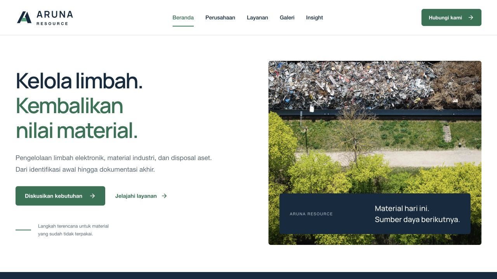
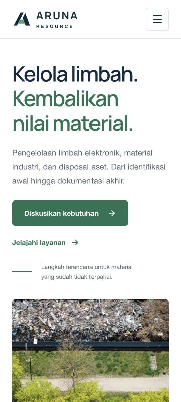
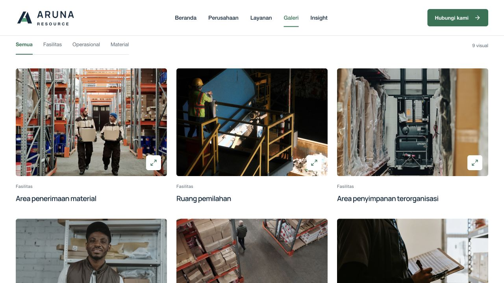

# Pemeriksaan implementasi

Diperiksa pada 2 Oktober 2026 melalui browser lokal, memakai hasil build statis di `http://127.0.0.1:4173`.

- `bun run build` lulus, termasuk pembuatan shell SPA dan TypeScript.
- `bun run check` lulus: TypeScript, Oxlint tanpa warning, dua Bun test dengan 29 assertions, dan Oxfmt.
- Seluruh 13 URL halaman/konten dimuat pada 360 × 800 dan 1440 × 900. Tidak ada overflow horizontal atau heading italic. Console hasil build bersih.
- Navigasi mobile menutup setelah pindah route; fokus berpindah ke heading halaman setelah route selesai dimuat.
- Galeri memfilter kategori, membuka dialog, berpindah visual termasuk dari awal ke akhir, menutup dengan Escape, dan mengembalikan fokus ke tombol pemicu.
- Kontak menolak kolom wajib kosong, email tidak valid, dan teks berisi spasi saja. Pratinjau memangkas spasi tepi. Edit mempertahankan input; reset mengosongkan seluruh form. Pilihan layanan dari halaman detail diteruskan ke kontak.
- Pencarian dan kategori artikel, hasil kosong, reset filter, artikel lengkap, daftar isi, dan tautan sumber diperiksa.
- Pemuatan langsung/reload route detail serta 404 untuk alamat dan slug layanan yang tidak tersedia diperiksa. Error hidrasi awal sudah diselesaikan dengan shell client-only.
- Garis proses mobile berakhir tepat sebelum ikon tahap berikutnya. Dukungan reduced motion ditinjau pada CSS dan hook; preferensi OS tidak diubah dalam pemeriksaan browser.

Tidak ada pengujian pengiriman pesan atau backend karena fitur tersebut belum tersedia. Konten dan foto stok merupakan ilustrasi konsep statis.

## Penggantian foto

Pemeriksaan ulang pada 2 Oktober 2026 setelah seluruh placeholder foto diganti:

- 13 foto stok dengan sumber dan lisensi tercatat di [image-sources.md](image-sources.md); 26 file WebP lokal valid dalam ukuran 640 dan 1600 piksel.
- Seluruh gambar pada 13 URL dimuat dengan `naturalWidth > 0`, pada desktop 1280 × 720 dan mobile 360 × 800. Tidak ada placeholder foto, gambar rusak, overflow horizontal, atau error/warning console.
- Sembilan gambar dialog galeri dimuat dan navigasi antarfoto berfungsi pada mobile.
- Crop ditinjau pada beranda, galeri, dan dialog; seluruh aset sumber juga diperiksa secara visual.
- `bun run build` dan `bun run check` lulus setelah perbaikan rasio gambar yang sempat membuat beranda dan detail layanan melebar di mobile.

## Screenshot

